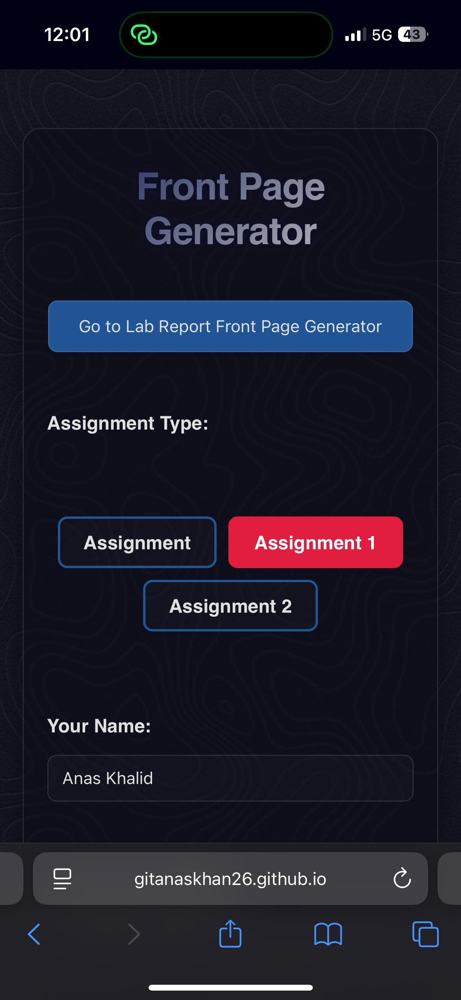
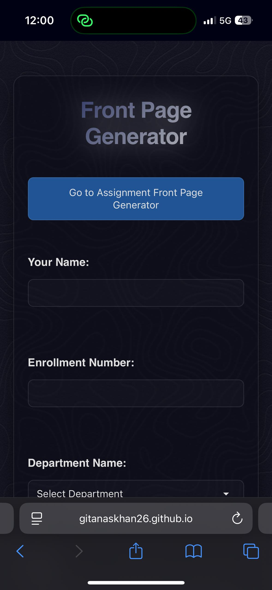
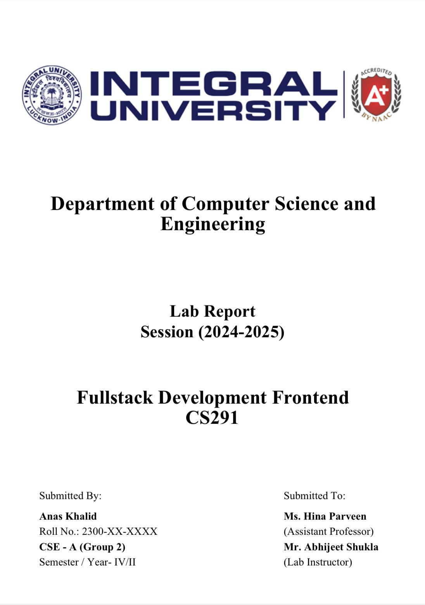
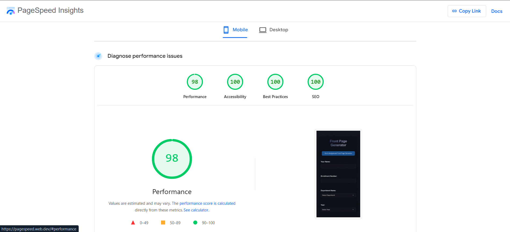
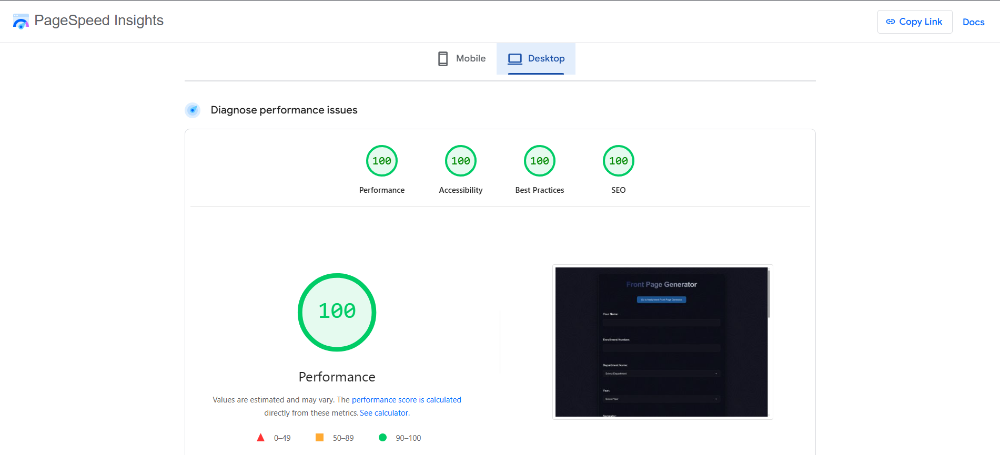

# 🧾 Front Page Generator

[](https://github.com/Gitanaskhan26/Front-Page-Generator/issues)
[](https://github.com/Gitanaskhan26/Front-Page-Generator/network)
[](https://github.com/Gitanaskhan26/Front-Page-Generator/stargazers)
[](LICENSE)

> A lightning-fast, customizable **PDF generator for Assignment and Lab Report front pages**, built using HTML, CSS, and JavaScript—no frameworks, no bundlers.

🔗 **Live Demo**: [Front Page Generator](https://gitanaskhan26.github.io/Front-Page-Generator/)

---

## 🚀 Features

- 📄 Multiple templates (Assignment & Lab Report)
- 🖊️ Customize name, subject, roll number, department, faculty and more
- 📦 Real-time preview
- 🧾 One-click **PDF download**
- 📱 Fully mobile-responsive
- ⚡ Optimized for **PageSpeed & Core Web Vitals**
- 🎯 Vanilla JS — no React/Vite

---

## 🛠️ Tech Stack

| Tech       | Purpose                                    |
|------------|--------------------------------------------|
| HTML5      | Markup and structure                       |
| CSS3       | Styling and layout                         |
| JavaScript | DOM logic and interactivity                |
| jsPDF      | PDF generation                             |
| pdf-lib    | Precise PDF text/image manipulation        |
| GitHub Pages | Free hosting and deployment              |

---

## 📁 File Structure

```bash
Front-Page-Generator/
├── App_favicon.png          # Website favicon
├── Contents.pdf             # Sample output or reference
├── LICENSE                  # Open source license
├── README.md                # This readme file
├── Script_Assignment.js     # JS logic for assignment template
├── Script_LabReport.js      # JS logic for lab report template
├── cartographer.avif        # Background image
├── index.html               # Main template (UI)
├── index2.html              # Alternate template
└── style.css                # All CSS styling
```

---

## 📸 Screenshots

### 🌐 Landing UI
     


### 🧾 PDF Output


### 📊 PageSpeed & Core Web Vitals



---

## 🚀 Quick Start

1. **Clone the repository**
   ```bash
   git clone https://github.com/Gitanaskhan26/Front-Page-Generator.git
   ```

2. **Navigate to the project directory**
   ```bash
   cd Front-Page-Generator
   ```

3. **Open in your browser**
   ```bash
   # Simply open index.html in your preferred browser
   # Or use a local server like Live Server in VS Code
   ```

4. **Start generating front pages!**
   - Fill in your details (name, subject, roll number, etc.)
   - Choose between Assignment or Lab Report template
   - Preview in real-time
   - Download as PDF with one click

---

## 👨‍💻 Contributors

[](https://github.com/Gitanaskhan26)

 [](https://github.com/saboorium)

[](https://github.com/abdul-rahman-1)

---

## 📚 Resources & References

- [jsPDF GitHub Repository](https://github.com/parallax/jsPDF)
- [pdf-lib Documentation](https://pdf-lib.js.org/)
- [PageSpeed Insights](https://pagespeed.web.dev/)
- [Web.dev: Core Web Vitals](https://web.dev/vitals/)
- [MDN Web Docs](https://developer.mozilla.org/): JavaScript, CSS, HTML references

---

## 🤝 Contributing

We welcome contributions! If you'd like to improve the UI, add new templates, or enhance features:

1. **Fork the repository**
2. **Create a feature branch**
   ```bash
   git checkout -b feature/amazing-feature
   ```
3. **Make your changes**
4. **Commit your changes**
   ```bash
   git commit -m 'Add some amazing feature'
   ```
5. **Push to the branch**
   ```bash
   git push origin feature/amazing-feature
   ```
6. **Open a Pull Request**

### Contribution Guidelines
- Follow existing code style and formatting
- Test your changes thoroughly
- Update documentation if needed
- Add screenshots for UI changes

---

## 🐛 Issues & Support

Found a bug or have a feature request? Please check our [Issues](https://github.com/Gitanaskhan26/Front-Page-Generator/issues) page first to see if it's already reported.

To report a new issue:
1. Go to the [Issues tab](https://github.com/Gitanaskhan26/Front-Page-Generator/issues)
2. Click "New Issue"
3. Provide a clear description and steps to reproduce

---

## 📄 License

This project is licensed under the **MIT License**. See the [LICENSE](LICENSE) file for details.

---

## ⭐ Show Your Support

If this project helped you, please consider giving it a ⭐ on GitHub! It helps others discover the project and motivates us to keep improving it.

---

## 🔮 Future Enhancements

- [ ] Additional template designs
- [ ] Custom logo upload support
- [ ] Integration with IUSMS & Other LMS platforms
- [ ] Theme customization options
